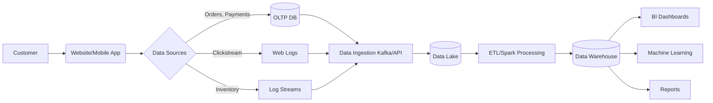

# 🛒 Enterprise E-commerce Data Engineering Lifecycle

[](https://github.com/)
[](https://opensource.org/licenses/MIT)

## 📌 Project Overview
This project studies and documents the complete end-to-end data engineering lifecycle for an enterprise e-commerce platform. The core objective is to understand how data flows seamlessly from generation to business consumption, carefully considering critical system undercurrents such as security, observability, and data privacy.

## 🎯 Problem Statement
This practical assignment requires us to:
* Map the five core stages of the data engineering lifecycle.
* Create a complete and comprehensive architecture diagram.
* Document essential system undercurrents, including security, observability, and data privacy.
* Utilize Git for version control and GitHub for professional repository management.

## 🚀 Objectives
By completing this practical, the key objectives are to:
* Understand the complete data engineering lifecycle from start to finish.
* Design an enterprise-grade data pipeline.
* Document the system architecture professionally.
* Learn and practice standard Git and GitHub workflows.
* Analyze operational trade-offs within data systems.

## 🔄 Data Engineering Lifecycle

| Stage | Description | Example Data | Technologies |
| :--- | :--- | :--- | :--- |
| **1. Data Generation** | Creation of raw data by user actions, transactions, or system events. | User clicks, finalized checkouts, stock level updates. | Web/Mobile Apps, OLTP DBs |
| **2. Data Ingestion** | Extracting data from sources and bringing it into the data platform. | Streaming click events, batch order dumps. | Apache Kafka, REST APIs, Fivetran |
| **3. Data Storage** | Storing ingested data securely and cost-effectively for downstream use. | Raw JSON, structured CSVs, Parquet files. | Amazon S3, Data Lake, HDFS |
| **4. Data Transformation** | Cleaning, validating, and converting data into structured formats (ETL/ELT). | Aggregated sales, deduplicated user sessions. | Apache Spark, dbt, SQL |
| **5. Data Serving** | Making processed data available for end-users, BI, or ML applications. | Daily sales dashboards, recommendation features. | Data Warehouse, Power BI, Tableau |

## 📊 Mock Dataset
The project deals with three primary datasets:

### 1. Transactional Database Schema
This dataset stores the finalized orders and payments.

```sql
CREATE TABLE orders (
    order_id INT PRIMARY KEY,
    customer_id INT,
    order_date TIMESTAMP,
    total_amount DECIMAL(10, 2),
    status VARCHAR(50)
);
```

### 2. Clickstream JSON Events
This dataset captures user interactions in real-time.

```json
{
  "event_id": "8f7e6d",
  "user_id": "user_405",
  "timestamp": "2023-10-25T14:30:00Z",
  "page_viewed": "/category/electronics",
  "action": "add_to_cart",
  "item_id": "item_992"
}
```

### 3. Inventory Log Streams
This dataset logs the availability of items in real-time. (Usually represented as CSV or JSON stream).
```csv
timestamp,item_id,warehouse_id,stock_quantity,status
2023-10-25T14:32:10Z,item_992,WH-01,145,AVAILABLE
```

## 🏗️ System Architecture
The data flows continuously from the source systems to the consumption layer:

Customer → Website/Mobile App → Orders, Payments, Clickstream, Inventory → Data Ingestion (Kafka/API) → Data Lake → ETL/Spark Processing → Data Warehouse → BI Dashboard / Reports / Machine Learning



## 🛡️ Cross-Cutting Undercurrents
These crucial elements are integrated at every stage of the lifecycle:

| Undercurrent | Implementation Strategy |
| :--- | :--- |
| **Security** | Role-Based Access Control (RBAC), end-to-end encryption (TLS for transit, AES-256 for at rest). |
| **Observability** | Centralized logging, automated alerting via Prometheus/Grafana, pipeline health monitoring. |
| **Data Privacy** | PII masking/tokenization (e.g., masking credit card info), GDPR/CCPA compliance checks. |

## 🛠️ Tools and Technologies

| Tool/Technology | Component/Usage |
| :--- | :--- |
| **Draw.io** | Architecture Diagramming |
| **Lucidchart** | Alternative Diagramming |
| **Git** | Local Version Control |
| **GitHub** | Remote Repository Hosting |
| **Apache Kafka** | Real-time Data Ingestion / Streaming |
| **Apache Spark** | Large-scale Data Transformation (ETL) |
| **SQL** | Database Querying / Transformation |
| **Python** | Scripting and Data Processing |
| **Data Warehouse** | Structured Data Serving Layer (e.g., Snowflake, BigQuery) |
| **Power BI** | Business Intelligence & Dashboards |
| **Tableau** | Alternative BI Tool |

## 📁 Project Folder Structure

```text
Data-Engineering-Lifecycle-Lab1/
├── README.md
├── architecture/
│   ├── lifecycle_diagram.drawio
│   └── lifecycle_diagram.png
├── dataset/
│   ├── ecommerce_schema.md
│   ├── clickstream.json
│   └── inventory_logs.csv
├── docs/
│   └── manifesto.md
└── images/
```

## 🧠 Key Analysis Questions

**1. How do downstream serving layers influence ingestion and storage decisions?**
Downstream requirements dictate the latency, structure, and volume needed. If real-time dashboards are required, ingestion must utilize streaming (e.g., Kafka) rather than batch processing, and storage must support rapid reads (e.g., in-memory databases or fast OLAP cubes).

**2. Differentiate between the Data Lifecycle and the Data Engineering Lifecycle.**
The **Data Lifecycle** focuses broadly on the data's journey from creation to archiving/deletion (creation, storage, use, share, archive, destroy), often from a governance perspective. The **Data Engineering Lifecycle** focuses on the technical processes and architecture required to move and transform data for use (generation, ingestion, storage, transformation, serving).

**3. How should security, observability, and privacy be enforced at each lifecycle stage?**
They must be treated as cross-cutting undercurrents:
*   **Security:** Enforce IAM policies and encryption at rest and in transit everywhere.
*   **Observability:** Implement logging and monitoring at every integration point and processing node to detect failures early.
*   **Privacy:** Anonymize or tokenize PII immediately at the ingestion stage to ensure downstream environments remain compliant.

## 🎓 Learning Outcomes
1. Comprehensive understanding of Data Engineering workflows.
2. Ability to design scalable Enterprise Architecture.
3. Hands-on conceptualization of ETL Pipelines.
4. Familiarity with Cloud Data Platforms and storage solutions.
5. Awareness of strict Data Governance and compliance practices.
6. Proficiency in Version Control using Git and GitHub.

## 🔮 Future Improvements
* Implemenation of full **Real-time streaming with Kafka**.
* **Cloud deployment on AWS/Azure/GCP** for enterprise scalability.
* Utilizing **Apache Airflow orchestration** for scheduling batch jobs.
* Integrating automated **Data Quality validation** frameworks (e.g., Great Expectations).
* Direct **Machine Learning integration** for real-time product recommendations.
* Developing interactive, **Real-time dashboards** for live monitoring.

## 💻 Git Commands

```bash
git init
git add .
git commit -m "Completed Practical 1"
git branch -M main
git remote add origin <repository-url>
git push -u origin main
```

## 🏁 Conclusion
This practical effectively demonstrates the complete enterprise data engineering lifecycle. By tracing data from its initial generation (via clickstreams and transactions) through to the final analytics layer, we have established a robust understanding of modern data platform design. The emphasis on cross-cutting concerns like scalability, security, observability, and privacy ensures that this foundational architecture is prepared for the rigorous demands of real-world enterprise environments.
